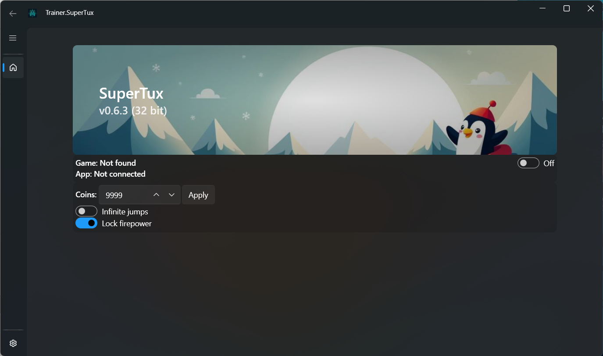

# Trainer.SuperTux

Experimental trainer for the 32 bit version of [SuperTux](https://www.supertux.org/) to experiment with the memory.dll library.

## Installation

- Download the latest version from [Releases](https://github.com/josdemmers/Trainer.SuperTux/releases)
- Extract files and run Trainer.SuperTux.exe

## Licensing

MIT

## Thirdparty packages

- [memory.dll](https://github.com/erfg12/memory.dll)
- [lepoco/wpfui](https://github.com/lepoco/wpfui)
